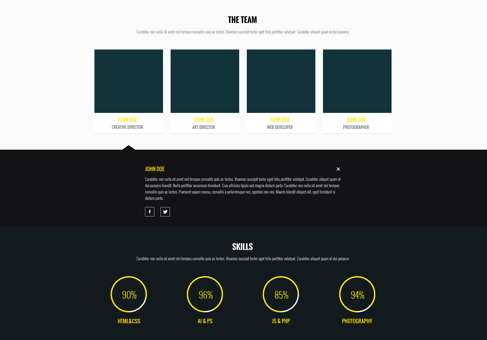
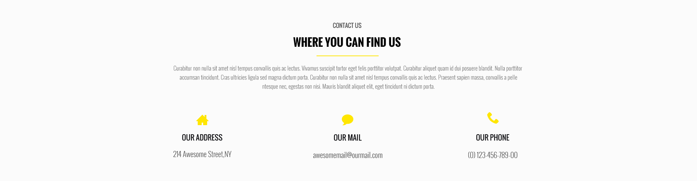
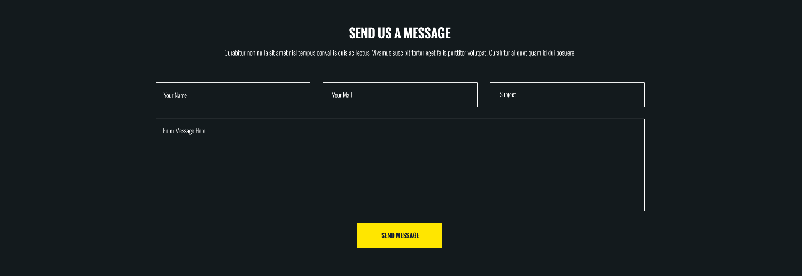
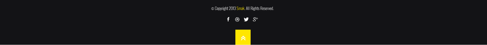

##Общие требования к сайту 
* Корректное отображение сайта на следующих разрешениях экрана: 320px, 687px, 992px, 1200 px 
* Поддержка браузеров: последние версии Chrome, Firefox, Safarі, Opera, MS Edge.

###Блок the team

* Добавьте произвольное фото для трех членов команды.
* При клике по изображению члена команды, под ним отображается блок с описанием его навыков.
  По умолчанию этот блок отображается для первого в списке человека.
* Когда блок впервые появляется не экране, числа, что показывают уровень владения каждой технологией,
  а так же круговые диаграммы, плавно увеличиватся от 0 до значений в макете.
 

###Блок SEND US A MESSAGE 

* Форма с полями Name, Email, Subject, Message. Валидация формы происходит при нажатии на клавиши.
При вводе пользователем некорректных данных в поле ввода под этим полем сразу отображается сообщение об ошибке.
 Сообщение об ошибке сразу же скрывается, если пользователь ввел корректные данные.
* В поле Name допускаются только буквы английского алфавита.
* В поле Email допускаются толко буквы английского алфавита, цифры, знак подчеркивание и симвом @.
* В поле Subject допускаются только буквы английского алфавита и цифры.
* В поле Message допускаются любые символы.

###Footer 

* Копирайт и ссылки на социальные сети.
* Кнопка со стрелкой вверх при нажатии на которую страница прокручивается в начало. 

